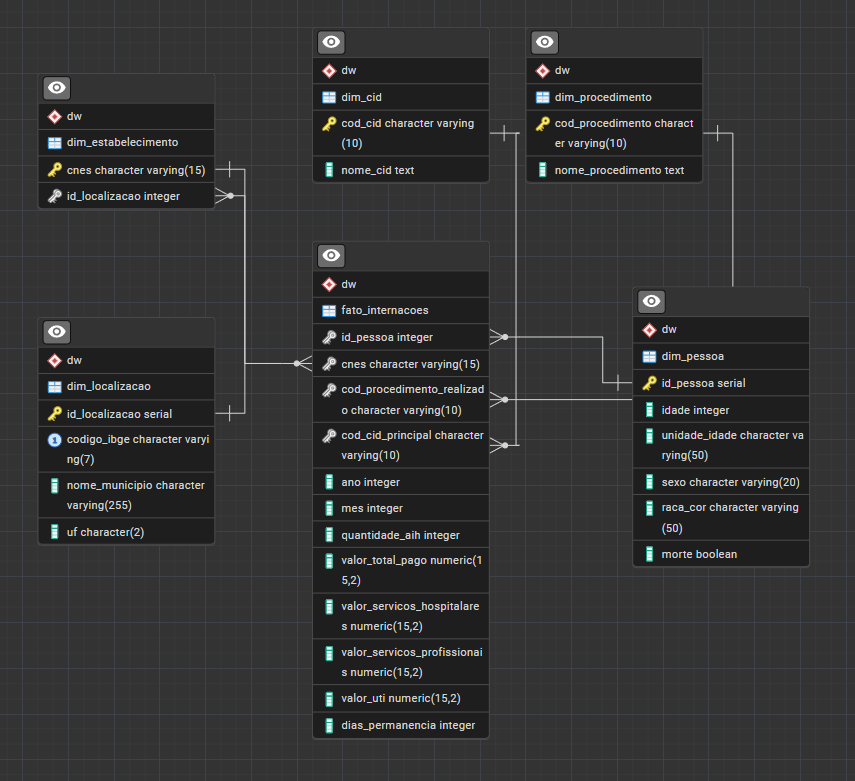
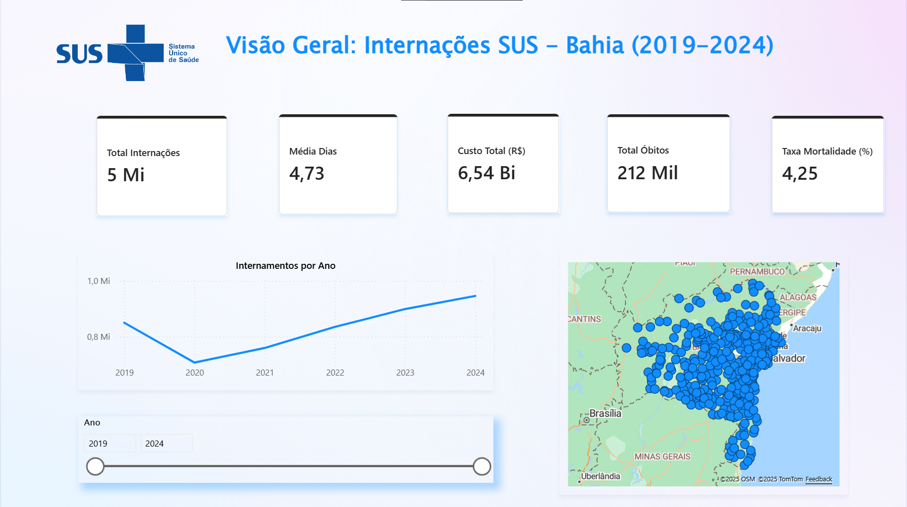

# 🏥 DATASUS Hospitalization Analysis (BI Project)

[](https://opensource.org/licenses/MIT)
[]()
[]()

A comprehensive **Business Intelligence** solution to extract, transform, and analyze public hospitalization data (SIHSUS) from the Brazilian Health System (DATASUS). 

**Scope:** State of **Bahia (BA)** | **Period:** 2019 to 2024.

---

## 🏗️ Project Architecture

This project follows a complete End-to-End Data Engineering pipeline:

1.  **Extraction:** Collecting `.dbc` files from DATASUS public FTP.
2.  **Transformation (Bronze Layer):** Converting binary `.dbc` to `.dbf` (using Tabwin) and then to `.csv` (using Python/Pandas).
3.  **Loading (Silver Layer):** Ingesting raw CSV data into PostgreSQL (`public` schema).
4.  **Modeling (Gold Layer):** Transforming data into a **Star/Snowflake Schema** Data Warehouse (`dw` schema).
5.  **Visualization:** Interactive Dashboards using **Microsoft Power BI**.

---

## 🚀 1. Setup & Installation

This project uses **Python**. First, create a virtual environment and install dependencies.

### On Windows
```bash
python -m venv venv
.\venv\Scripts\activate
pip install -r requirements.txt
```
### On macOS and Linux
```script
python3 -m venv venv
source venv/bin/activate
pip install -r requirements.txt
```
## ⚙️ 2. ETL Process Pipeline

The project follows a linear pipeline to process public health data.

### Step 1: Extraction (Download)
We acquire the raw data files from the official DATASUS FTP server.
- **Source:** [DATASUS File Transfer Portal](https://datasus.saude.gov.br/transferencia-de-arquivos)
- **System:** SIHSUS (Hospital Information System).
- **File Type:** `RD` (Reduced AIH) - Provides hospitalization details.

**Data Scope:**
- **Location:** State of Bahia (BA).
- **Period:** Jan/2019 to Dec/2024.
- **Format:** Compressed binary files (`.dbc`).

---

### Step 2: Decompression (DBC to DBF)
DATASUS files use a proprietary compression format (`.dbc`) that is not natively readable by standard data tools.
1.  Use the **TabWin** software (official tool from DATASUS).
2.  Navigate to `Arquivo` > `Comprime/Expande .DBF`.
3.  Select the downloaded `.dbc` files.
4.  Save the resulting `.dbf` files into the `input_dbf/` project directory.

---

### Step 3: Conversion (DBF to CSV)
We use Python to convert the legacy `.dbf` format into standard `.csv` files, handling character encoding (Latin-1) and delimiters automatically.

Ensure your `.dbf` files are in `input_dbf/` and run:

```bash
python src/convert_dbf_to_csv.py
```
Output: Clean `.csv` files will be generated in the `output_csv/` folder.

### Step 4: Loading to Database
Finally, we ingest the CSV data into the PostgreSQL database. This script reads the files, cleans header names, and inserts them into the public schema (Staging Area).

```bash
python src/import_data.py
```

## 🗄️ 3. Data Warehouse Modeling

In this stage, raw data from the Staging Area (`public` schema) is transformed into a structured **Dimensional Model** inside the `dw` schema. This structure is optimized for high-performance analytical queries (OLAP).

### Architecture Strategy
We implemented a **Hybrid Star/Snowflake Schema**. While most dimensions link directly to the Fact table, the *Establishment* dimension is normalized to link with *Location*, ensuring data integrity and reducing redundancy.



### Key Components

* **Fact Table (`Fato_Internacoes`):**
    Contains over 5 million records. It stores quantitative metrics (Cost, ICU Value, Days of Stay) and foreign keys to all dimensions.
    * *Granularity:* One row per hospitalization authorization (AIH).

* **Dimensions:**
    * **`Dim_Pessoa`:** Stores patient demographics. We applied strict data cleaning rules here to standardize Age Units and Race/Color codes (mapping legacy codes like `'1'` to standard `'01'`).
    * **`Dim_Estabelecimento`:** Linked to `Dim_Localizacao` (Snowflake pattern) to organize hospitals by municipality.
    * **`Dim_CID` & `Dim_Procedimento`:** Includes logic to handle "orphan" codes (codes present in historical records but missing from official tables).

---

### 🛠️ Building the Data Warehouse

To reproduce the environment, execute the SQL scripts located in the `sql/` folder in the following order:

1.  **Schema Definition:**
    Creates the tables and relationships (Foreign Keys).
    ```bash
    psql -d dados_brutos_sus -f sql/01_create_schema.sql
    ```

2.  **Dimension Loading:**
    Extracts unique values from raw data, cleans inconsistencies, and populates dimension tables.
    ```bash
    psql -d dados_brutos_sus -f sql/02_populate_dimensions.sql
    ```

3.  **Fact Table Loading:**
    Performs lookups to generate surrogate keys and loads transactional data (filtered for 2019-2024).
    ```bash
    psql -d dados_brutos_sus -f sql/03_populate_fact.sql
    ```
## 📊 4. Business Intelligence (Power BI)

The final deliverable is an interactive Power BI Dashboard containing **9 analytical screens**, designed to support strategic decision-making in public health management.



> 💡 **Explore More:** You can view screenshots of all 9 screens in the [Screenshots Folder](bi/screenshots/) or download the **[Power BI File (.pbix)](bi/datasus_bahia.pbix)** to interact with the data directly.
### Dashboard Structure:

1.  **Executive Overview:** High-level KPIs (Admissions, Costs, Mortality) and geographical distribution map.
2.  **Time Analysis:** Historical evolution and seasonality comparison (Year-over-Year).
3.  **Clinical Profile:** Top Diagnoses (ICD-10) and Procedures, highlighting diseases with long hospital stays.
4.  **Patient Demographics:** Population analysis via Age Pyramid, Sex, and Race/Color distribution.
5.  **Mortality Analysis:** Lethality rates, deadliest diseases, and risk correlation by age group.
6.  **Age Cycle Analysis:** Heatmap visualization showing the epidemiological transition of diseases across different life stages.
7.  **COVID-19 Monitor:** Dedicated panel filtered for Coronavirus codes (`B342`) to analyze pandemic impact.
8.  **Financial Audit (Part 1):** Cost breakdown using **Decomposition Tree** (Drill-down: Municipality → Disease → Procedure).
9.  **Financial Audit (Part 2):** Detailed composition of expenses (Hospital Services vs. Professional Fees vs. ICU costs).

## 🛠️ Technologies

* **Language:** Python 3.10+
* **Libraries:** Pandas, SQLAlchemy, Psycopg2, Dbf.
* **Database:** PostgreSQL 16.
* **Visualization:** Microsoft Power BI.
* **IDE:** VS Code & pgAdmin 4.

## ✒️ Authors

* **Filipe Neves** - *Data Engineer & BI Developer* - [LinkedIn Profile](https://www.linkedin.com/in/filipe-ns)
    * Responsible for the end-to-end development lifecycle: Data Extraction, Python ETL scripts, Data Warehouse Modeling (SQL), and Power BI Dashboard implementation.
    
* **Elias Reis** - *Project Collaborator & Repository Maintainer* - [LinkedIn Profile](https://www.linkedin.com/in/elias-reis-/)
    * Responsible for repository management, documentation review, and academic support.

---
*Project developed for the **Special Topics in Databases** course in the **Information Systems** degree program at **Universidade do Estado da Bahia (UNEB)**.*